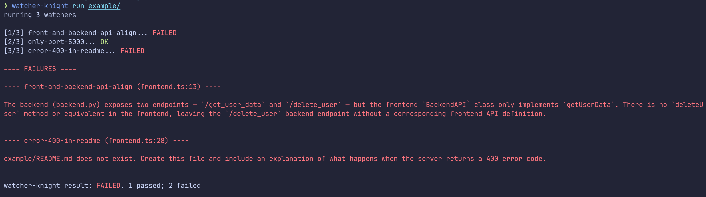

# Watcher Knight

Automatic code validation tool powered by LLMs.

Verify code properties that are difficult to reason about using static analysis or tests.

## What It Does

`watcher-knight` scans your codebase for `<wk ... />` markers.

For each marker, it runs a Claude agent to check whether the property still holds.

Think of it as assertions, but for cross-file concerns, architectural constraints, and integration contracts that traditional linters / type checkers / test suites can't catch.

Features: 
- **Caching.** Cache previous results if `files-to-watch` do not change
- **Git mode.** Run watchers against git diffs.
- **Per-watcher options.** Specify Claude models and permissions for each watcher.

## Example Usage

Add "watchers" anywhere in your codebase using the format:

```ts
// <wk: <watcher-name> [<files-to-watch (relative to current dir)>]
// options={...}  <-- optional
// Properties to check for / validate />
```

For example (`example/frontend.ts`):

```ts
// -- EXAMPLE 1: Validating APIs --
// <wk: front-and-backend-api-align [./frontend.ts, ./backend.py]
// Ensure that the backend (backend.py) and frontend (frontend.ts) API definitions align />
//
// ^ This will fail: the API definitions do not align
// (The previous result will be cached unless ./frontend.ts or ./backend.py are updated)
class BackendAPI {
  // -- EXAMPLE 2: Verifying port constraints --
  // <wk: only-port-5000 [.]  <-- recursive on all files in current dir
  // options={model="haiku"}
  // Check that this is the only service started on port 5000. />
  //
  // ^ This will pass: this is the only service on port 5000
  constructor(private baseUrl = "http://localhost:5000") { }

  // -- EXAMPLE 3: Updating READMEs --
  // <wk: error-400-in-readme [.]
  // example/README.md should explain what happens when the server returns error code 400 />
  //
  // ^ This will fail: the check cannot be completed as example/README.md does not exist
  async getUserData(name: string): Promise<UserData> {
    const res = await fetch(
      `${this.baseUrl}/get_user_data?name=${encodeURIComponent(name)}`,
    );
    if (!res.ok) {
      throw new Error(`Request failed: ${res.status} ${res.statusText}`);
    }
    return res.json();
  }
}
```

To run the watcher knight: 



## Installation

```sh
cargo install --path .
```

Requires [Claude Code](https://docs.anthropic.com/en/docs/claude-code) to be installed and authenticated.
